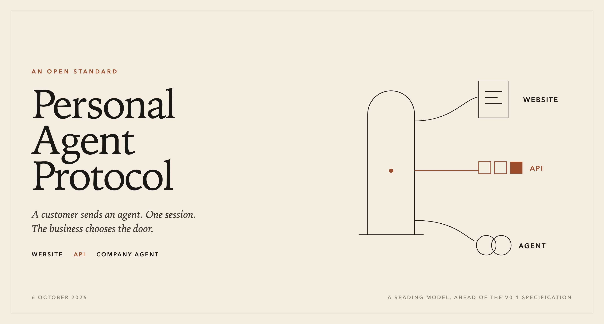

# Personal Agent Protocol

*About a three-minute read. A reading model of the standard Meta and Sierra announced on 6 October 2026, with Genesys, Instinct, Rocket, Shopify, Stripe, and Walmart. Version 0.1 of the specification is still to be published.*

Personal agents already book the flight, move the delivery, and open the warranty claim. They do the work the way a person would: load the page, read the form, and click through. The task takes as long as the site takes, and the business sees a browser where the customer meant to send a representative.

Personal Agent Protocol is the open standard Meta and Sierra announced on 6 October 2026 for that visit. Genesys, Instinct, Rocket, Shopify, Stripe, and Walmart are developing it with them. A customer can send an agent. The business can see who that agent represents, and can decide what the agent may do. The company that builds the personal agent gets one way to reach every business that takes part.

The principle splits in two. The customer decides what access to give. The business sets the bounds of that access, and chooses the route that serves the customer: its website, its APIs, or an agent of its own.

## How a visit runs

The visit starts on the website. The personal agent discovers what the company offers and how to reach it: a place to sign in, and the interfaces the company has opened. The discovery file in this repository is a reading model of that step. The field names are a teaching device. The specification will choose its own.

The agent then opens a session for its user.

A guest session is enough when the question is public. Is the item in stock. How long is the returns window. The guest leaves the account untouched.

When the task needs the account, the customer signs in on the company's own page, or the agent presents access the customer has already granted. The session is built on OAuth. The customer chooses read-only access or write access. The session continues across the whole visit. A question asked before sign-in and a change made after it are one piece of work, including when the work moves from a web page to an API call to a conversation.

The business then offers the route it wants used.

On the website, the agent uses the company's ordinary pages, and the business can tell an agent is there.

On the API, the agent calls an interface the company has published. Sierra describes these interfaces as built on standards such as MCP and OpenAPI. Changing a delivery address is one call. The call carries who the agent represents, the scope the customer granted, and the new address. The business applies its own rules and answers.

On the company's agent, the work is a conversation. A warranty claim. A booking that has to be rebuilt. The company's agent carries the case. Partners working on the protocol have described the handoff this way: when the case needs judgment, a person joins the same conversation, already holding the context, and each reply says whether an agent or a person is speaking.

Take a delivery address. The customer has already asked, as a guest, whether an open order can be rerouted. That question and the later change share one session. The customer grants write access. The shop in these examples, Northline Goods, publishes an API for open orders, and the agent uses it. Had the parcel already left the depot, the same session would have gone to Northline's own agent, because the work would have become a conversation.

The company decides what it publishes. The personal agent gets a consistent way in. The customer gets the outcome.

## The visit around the tools

MCP and OpenAPI describe a capability: the action, the inputs, the result. Personal Agent Protocol describes the visit those capabilities sit inside. Who is represented. What the customer allowed. Which door the business opened. A page, a call, and a conversation can share that session.

## What is still ahead

Sierra has said a version 0.1 specification is coming, with a reference implementation to follow. The same announcement names what that first cut leaves open. Finer limits, so a customer can allow a read of an order and withhold a cancellation. A push from the business at the moment a flight slips or an order ships. A payments extension, so the agent can complete a purchase while the card number stays with the business.

These files follow that announcement. They are a model for reading the design ahead of the specification. When version 0.1 is published, start with [the model](docs/model.md).

## Read the visit

The essay above is the whole argument. The rest of the repository is that argument opened up. The same essay, set for publishing, is in [blog/personal-agent-protocol.md](blog/personal-agent-protocol.md).

- [Model](docs/model.md). What the announcement fixes in place, and what these files invent.
- [Walkthrough](docs/walkthrough.md). Northline Goods, order `NL-20418`, one session.
- [Discovery](examples/discovery/.well-known/personal-agent.json). Sign-in and the three doors, in one document.
- [Guest session](examples/session/guest.json) and [the same visit after write access](examples/session/authorized.json).
- [Website](examples/routes/website.md), [API](examples/routes/api/openapi.yaml), and the [company agent](examples/routes/agent/warranty.md).

## Sources

- Bret Taylor and Clay Bavor, “Introducing Personal Agent Protocol,” Sierra, 6 October 2026. <https://sierra.ai/blog/introducing-personal-agent-protocol>
- NiCE’s description of the proposed approach, reported by IT Brief on 7 October 2026: a document at a known address, a scoped token for each customer, and replies that say whether an agent or a person is speaking. <https://itbrief.com.au/story/meta-nice-back-ai-agent-protocol-for-customer-service>
